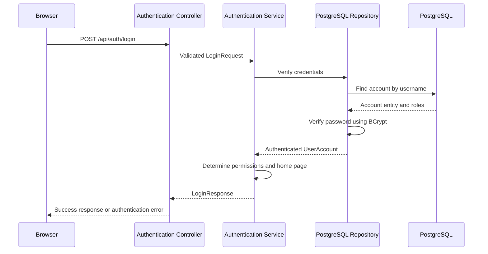

# Architecture

## 1. Architecture Overview

MemberNet Sprint 1 is implemented as a modular, layered Spring Boot application.

The application uses Java 21, Spring Boot 3.5, Maven, PostgreSQL 18 and a static browser interface built with HTML, CSS and JavaScript.

The browser interface is served by the same Spring Boot application. This keeps Sprint 1 deployable as a single application container while maintaining a REST boundary that allows a separate frontend to be introduced in the future.

## 2. Layered Architecture

The application is divided into the following layers:

```
Presentation Layer
        |
        v
Controller Layer
        |
        v
Service Layer
        |
        v
Repository Layer
        |
        v
PostgreSQL Database
```

### 2.1 Presentation Layer

The presentation layer contains:

```
static/index.html
static/styles.css
static/app.js
```

Its responsibilities are:

* Displaying the login page
* Collecting the username and password
* Sending the login request to the REST API
* Displaying account information
* Displaying permissions
* Showing the appropriate home page
* Displaying success and error messages
* Providing logout functionality

### 2.2 Controller Layer

The controller layer contains:

```
AuthenticationController
ApiErrorHandler
```

`AuthenticationController` receives authentication requests from the browser and forwards valid requests to the service layer.

`ApiErrorHandler` converts application exceptions into meaningful HTTP error responses.

### 2.3 Service Layer

The service layer contains:

```
AuthenticationService
```

Its responsibilities are:

* Verifying user credentials
* Loading the authenticated account
* Reading the account roles
* Determining the user's permissions
* Selecting the appropriate home page
* Creating the login response

### 2.4 Domain Layer

The domain layer contains:

```
UserAccount
Role
UserAccountRepository
```

`UserAccount` represents authenticated account information.

`Role` defines the available permissions:

```
MEMBER
ADMIN
```

`UserAccountRepository` is the persistence interface used by the service layer. This interface separates the authentication logic from the database implementation.

### 2.5 Persistence Layer

The persistence layer contains:

```text
UserAccountEntity
SpringDataUserAccountRepository
PostgresUserAccountRepository
```

`UserAccountEntity` maps user accounts and roles to PostgreSQL tables.

`SpringDataUserAccountRepository` provides database queries through Spring Data JPA.

`PostgresUserAccountRepository` implements the domain repository interface and converts database entities into domain objects.

### 2.6 Database Layer

PostgreSQL 18 stores persistent account information.

The main database tables are:

```
user_accounts
user_account_roles
```

The `user_accounts` table stores:

* Account ID
* Username
* BCrypt password hash
* Display name
* Member ID

The `user_account_roles` table stores the roles assigned to each account.

## 3. Authentication Flow



The authentication workflow is:

1. The user enters a username and password.
2. JavaScript sends the credentials to the REST controller.
3. The controller validates the request.
4. The service asks the repository to verify the credentials.
5. The repository loads the account from PostgreSQL.
6. BCrypt compares the entered password with the stored password hash.
7. The service reads the user's roles.
8. The service selects the Member home page or Administrator dashboard.
9. The browser displays the account information and success confirmation.
10. Logout clears the browser session data and returns to the login page.

## 4. Database Integration

The first application prototype used an in-memory repository with demonstration accounts.

During development, the in-memory implementation was removed and replaced with real PostgreSQL persistence.

The final application uses:

* PostgreSQL 18
* Spring Data JPA
* Hibernate
* `UserAccountEntity`
* `SpringDataUserAccountRepository`
* `PostgresUserAccountRepository`

This change ensures that account data is stored persistently and remains available after an application restart.

The repository interface allows the persistence technology to be changed without modifying the controller, service, user interface or domain model.

## 5. Password Security

Passwords are not stored as plain text.

The application uses:

```
BCryptPasswordEncoder
```

When an account is created, its password is converted into a BCrypt hash before being stored in PostgreSQL.

During login, the entered password is compared with the stored hash.

This improves security because the original password cannot be directly read from the database.

## 6. Permissions and Role-Based Routing

The application supports two roles:

### MEMBER

A user with the `MEMBER` role receives the Member home page.

### ADMIN

A user with the `ADMIN` role receives the Administrator dashboard.

Administrator accounts currently contain both roles:

```
ADMIN
MEMBER
```

The role-based result is currently used to select the correct user interface.

Future protected business endpoints should enforce authorization using Spring Security.

## 7. Error Handling

Authentication errors are handled centrally through:

```
InvalidCredentialsException
ApiErrorHandler
```

Invalid usernames and incorrect passwords produce a meaningful but generic error response.

A generic response avoids revealing whether a specific username exists in the database.

Validation errors are returned when required request values are missing or invalid.

## 8. Deployment Architecture

MemberNet supports container-based deployment using Docker and Docker Compose.

The Docker architecture contains two services:

```
membernet
postgres
```

### 8.1 MemberNet Service

The MemberNet service:

* Uses a Java 21 runtime image
* Runs the Spring Boot executable JAR
* Exposes port `8080`
* Runs as non-root user `1001`
* Receives database configuration through environment variables
* Waits for PostgreSQL to become healthy

### 8.2 PostgreSQL Service

The PostgreSQL service:

* Uses the PostgreSQL 18 Docker image
* Creates the `membernet` database
* Uses a persistent Docker volume
* Provides a `pg_isready` health check
* Communicates with MemberNet through the Docker network

The MemberNet container connects to PostgreSQL using:

```text
jdbc:postgresql://postgres:5432/membernet
```

The hostname is `postgres`, which is the Docker Compose service name.

## 9. Configuration and Secrets

Database credentials are provided through environment variables.

The database password is referenced as:

```text
DB_PASSWORD
```

The password must not be stored directly in:

* `application.properties`
* `application.yml`
* `docker-compose.yml`
* GitHub

This allows different credentials to be used in local, Docker and future deployment environments.

## 10. Monitoring and Operations

Spring Boot Actuator provides the health endpoint:

```text
/actuator/health
```

A healthy application returns:

```json
{
  "status": "UP"
}
```

The endpoint can be used for:

* Manual operational verification
* Docker health monitoring
* Future Kubernetes readiness and liveness probes
* Future monitoring integration

## 11. Kubernetes Compatibility

Kubernetes deployment is planned for Sprint 2 and is not implemented in the final Sprint 1 solution.

Sprint 1 remains compatible with a future Kubernetes environment because it provides:

* A Docker image
* Environment-based configuration
* A stable application port
* A health endpoint
* A stateless application backend
* A separate PostgreSQL service
* A layered and modular architecture

Future Kubernetes work can add:

* Deployment
* Service
* ConfigMap
* Secret
* Readiness probe
* Liveness probe
* Resource requests and limits

## 12. Testing Architecture

The project uses Spring Boot Test, JUnit and Mockito for automated controller testing.

The tests verify:

* Successful authentication
* Invalid credential handling
* HTTP responses
* Controller behavior

The final Maven build completed with:

```text
Tests run: 2
Failures: 0
Errors: 0
Skipped: 0
BUILD SUCCESS
```

## 13. Architecture Decision Summary

The layered architecture was selected because it provides:

* Clear separation of responsibilities
* Improved readability
* Easier testing
* Easier maintenance
* Replaceable persistence implementations
* Future frontend flexibility
* Container deployment support
* Future Kubernetes compatibility

The final architecture is suitable for the small Sprint 1 scope while remaining extensible for later MemberNet sprints.
