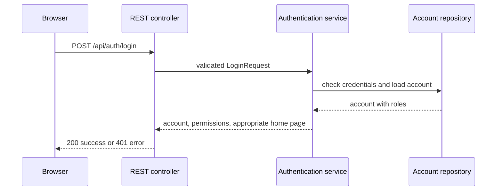

# Architecture

## Design decision: modular layered Spring Boot application

**Decision.** The application uses Java 21 and Spring Boot 3.5 with a static browser user interface served by the same application. The backend is divided into presentation (`auth` controller), application (`AuthenticationService`), domain (`UserAccount`, `Role`) and persistence-port (`UserAccountRepository`) layers.

**Reasoning.** Spring Boot provides an established Java REST runtime, validation, testing and operational endpoints with a small amount of infrastructure. Serving the initial UI from the backend keeps the training project deployable as one container while the REST boundary allows a separate frontend later.

## Authentication flow

## Future database integration

`UserAccountRepository` is an interface. `InMemoryUserAccountRepository` is an adapter used only for the training demonstration. A future JPA/database adapter can implement the same port and be selected through Spring configuration without changing the controller, service, UI, or domain model. Passwords are intentionally plaintext only because the two training accounts are non-production fixtures; production implementation must store a salted adaptive hash (for example BCrypt or Argon2), use a database and introduce real session/token management.

## Permissions

The service reads roles from the loaded account. `ADMIN` receives the administrator dashboard; `MEMBER` receives the member home page. This is presentation routing for the small scope; future protected business endpoints should enforce permissions with Spring Security authorization.

## Deployment and operations

The supplied Dockerfile creates a small Java 21 runtime image and runs as a non-root user. The Kubernetes manifest deploys two replicas, resource bounds and actuator readiness/liveness probes. Health is exposed at `/actuator/health`, `/actuator/health/liveness`, and `/actuator/health/readiness`; app metadata is available through `/actuator/info`.
